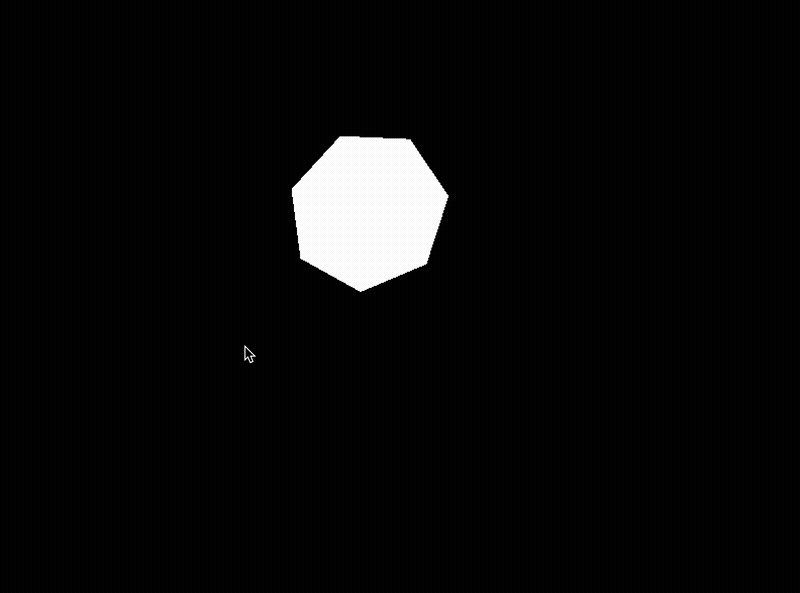

# Harmonica

[](https://github.com/go2hx/harmonica/actions/workflows/hl.yml)
[](https://github.com/go2hx/harmonica/actions/workflows/interp.yml)
[](https://github.com/go2hx/harmonica/actions/workflows/js.yml)


[Harmonica Go library](https://github.com/charmbracelet/harmonica) compiled with [go2hx](https://go2hx.github.io/) v0.1.0


[Try it online!](https://go2hx.github.io/samples/harmonica.html)

# Installation

```sh
haxelib git go2hx_harmonica https://github.com/go2hx/harmonica

haxelib git heaps https://github.com/HeapsIO/heaps
haxelib install hlsdl
```
Add ``-lib go2hx_harmonica`` to your hxml for openfl/haxeflixel users ``<haxelib name="go2hx_harmonica" />``


# Why use this?

You want to create physics animations like the one seen above. It's platform agnostic, and can work in both 2D and 3D contexts. It's simple and low cost per frame.

# Next steps

Run into an issue, feel free to make an [issue](https://github.com/go2hx/harmonica/issues) detailing how to reproduce and the env being used (Haxe version, OS etc)

Interested in [more libs like this](https://github.com/go2hx#working-haxelibs-precompiled)?

Want to get involved in go2hx and/or the Haxe community, [join the discord!](https://discord.com/invite/0uEuWH3spjck73Lo)
